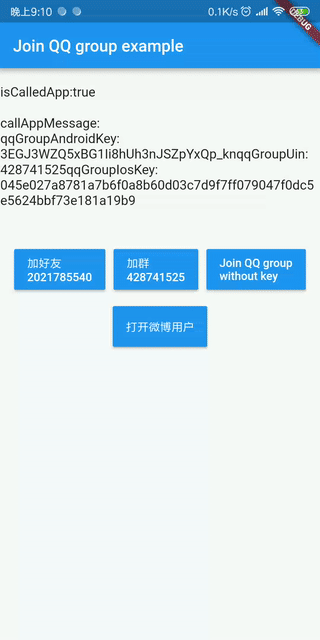
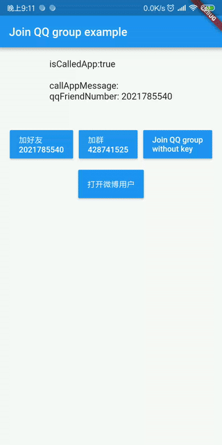
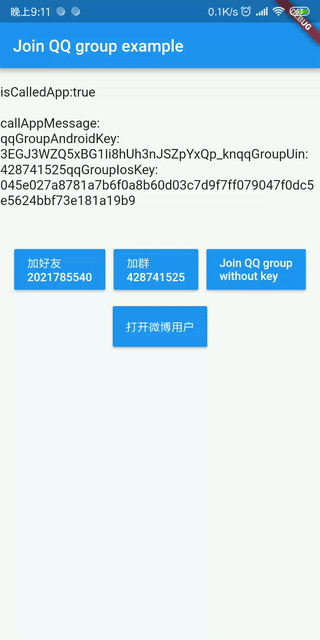
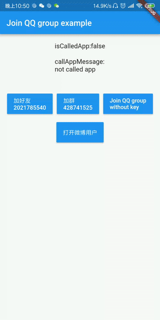
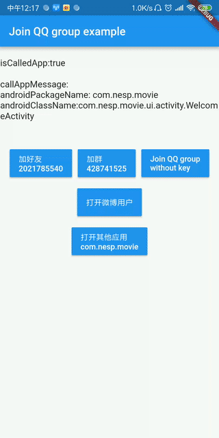

# flutter_plugin_nesp_social

**This repository has been moved to [nesp_sdk_flutter_social](https://github.com/nespjin/nesp_sdk_flutter/tree/master/packages/nesp_sdk_flutter_social) and it will be deleted!!!**

**This repository has been moved to [nesp_sdk_flutter_social](https://github.com/nespjin/nesp_sdk_flutter/tree/master/packages/nesp_sdk_flutter_social) and it will be deleted!!!**

**This repository has been moved to [nesp_sdk_flutter_social](https://github.com/nespjin/nesp_sdk_flutter/tree/master/packages/nesp_sdk_flutter_social) and it will be deleted!!!**


A Flutter plugin for social.

Support QQ Group:428741525

[中文](./README-ZH-cn.md)

***
This plugin supports Android and iOS.

****

## Screentshots
>### Join QQ Friend
>
> 

***

> ### Join QQ Group
> 


***

> ### Join QQ Group no key
> #### (This is a case of error when calling)
> 

***

> ### Open Weibo User
> 

***

> ### Open Other App
> 

## Getting Started 

This project is a starting point for a Flutter
[plug-in package](https://flutter.io/developing-packages/),
a specialized package that includes platform-specific implementation code for
Android and/or iOS.

For help getting started with Flutter, view our 
[online documentation](https://flutter.io/docs), which offers tutorials, 
samples, guidance on mobile development, and a full API reference.


### Join QQ Friend

```dart
try {
      isSuccess = await FlutterNespSocial.joinQQFriend(
        qqFriendNumber: "input your qq friend number",
      );
      
    } on PlatformException catch (e) {
      //do something 
    }
```

### Join QQ Group

```dart

try {
   isSuccess = await FlutterNespSocial.joinQQGroup(
        androidKey:  "input your android key",
        groupUin:  "input your group uin",
        iosKey: "input your ios key",
      );

    } on PlatformException catch (e) {
        //do something
    }

```

### Open Weibo User

```dart

try {
    isSuccess =  await FlutterNespSocial.openWeiboUser(
        uid: “input your weibo user id”,
      );
    } on PlatformException catch (e) {
     // do something
    }

```

### Open Other App
``` dart

try {
      isCalledOtherApp = await FlutterNespSocial.openOtherApp(
        androidPackageName: "input your android app package name",
        androidClassName: "input your android activity class name",
        iosAppUrl: "input your IOS APP URL",
      );
    } on PlatformException catch (e) {
     //do something
    }

```
